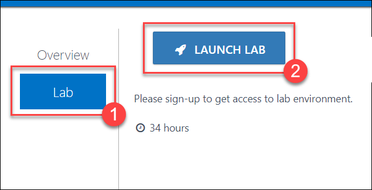
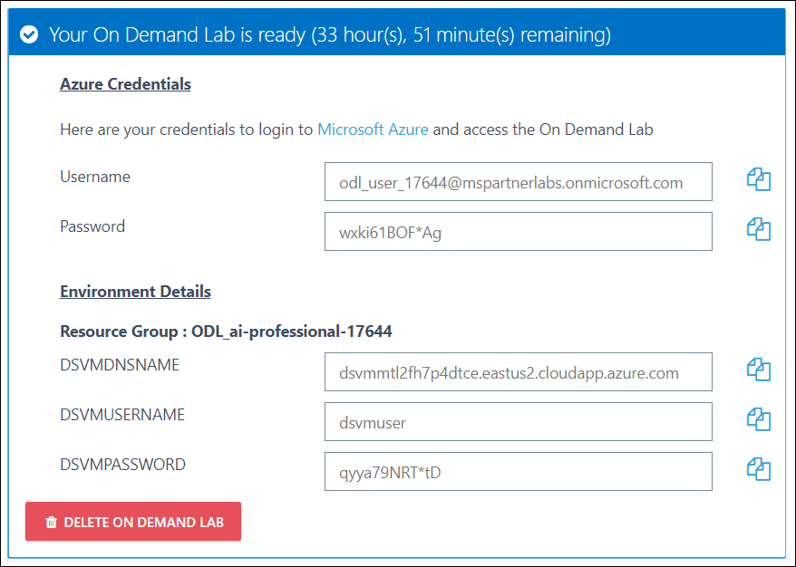

# Introduction

In this workshop, you will complete a web app using Machine Learning to predict travel delays given flight delay data and weather conditions, plan the bulk data import operation, followed by preparation tasks, such as cleaning and manipulating the data for testing, and training your Machine Learning model. You can find details about the worksohp [here](http://bit.ly/Bigdata-doc-v1).

# Sign-up for Workshop Environment

To make it easier for you to work on the labs, you are provided with pre-provisioned Azure environment. You will receive sign-up link for the lab environment from your instructor. 

* Register for the lab environment by providing your information and clicking on **Submit** button.
 

* On the next page, click the **Launch Lab** button.
  
 
* Wait for the lab environment to be provisioned. Sometimes this can take upto **10 minutes**. Once environment provisioning is complete, you will receive details in email as well as in the browser.
 
 
 > Note: Lab environment is enabled only for specific duration or workshop end time - whichever is earlier. At the end of the allowed time, environment will be self-destructed.

# Verify the pre-provisioned Environment

## Verify Azure Access

Open a browser instance in private or incognito mode and login to [Microsoft Azure Portal](https://portal.azure.com) using the credentials provided.

> Note: You might have an existing Azure Credential. For the pre-provisioned environment, new Microsoft Azure environment is provisioned and new AAD user is created for you. To prevent conflict with your existing accounts, it is advised to use In Private mode of IE / IE Edge or Incognito mode of Chrome browser.

## Verify Virtual Machine

You are provided a [Data Science Virtual Machine - Windows 2016](https://azuremarketplace.microsoft.com/en-us/marketplace/apps/microsoft-ads.windows-data-science-vm) with additional softwares configured. FQDN of the virtual machine and administrator credentials are provided in the lab details page. You can remote into the virutal machine using the provided credentials and validate the following:

> Note: DSVM is provisioned in the resource group, in which you have access. Once you login to Microsoft Azure Portal, you can navigate to this VM to find more details.
## Verify the following Azure resources
* **Machine Learning Studio Workspace** is provisioned in the resource group, in which you have access.

* **Azure HDInsight Cluster** : Refer registration page/email for cluster credentials and cluster ssh credentials. .  
* Other Azure resources such as **Virtual Network, Public IP, Network Interface, Load Balancer, Storage accounts** as required by HDInsight, VM and Machine learning studio.

# Known Issues

### Failure while creating Data Factory

> **Possible Solutions**:

 * Check and ensure if the Data Factory Version used is V1.

# Notes to Instructors / Proctors

###  Replace Exercise 7 with the following Exercise in this document

Instead of Exercise 7 in the lab guide, atendees should continue the lab with Exercise 7 provided in this document. .

# Help and Support

If you require any help during the workshop, please reach out to the instructor / proctors. Instructors / proctors might escalate the issue to remote support team, at that time, please pass on your AAD User ID (aad_user_xyz), so that it is easier to look up your environment.
